<!-- GENERATED FILE - do not edit by hand.
     Source: src/main/java/PhaseSummary.java
     Regenerate: mvn -o compile exec:java -Dexec.mainClass=SlideDeckGenerator -->

# Building AI Agents in Java

### 16 phases, hand-rolled, one throughline

From "what is a token" to a credential-scoped, schema-gated, self-evaluating agent pipeline - every mechanism built from scratch in plain Java rather than pulled from a framework, because the point was to understand the mechanics, not to ship the fastest.

Each slide: **what the phase teaches**, a diagram of the mechanism, and **the line worth keeping**.

---

## Phase 0 - Foundations: tokens, weights, sampling

**Key concept:** Text becomes token ids, the model emits logits over the whole vocabulary, and temperature/top-p/top-k decide which token that distribution actually collapses to.

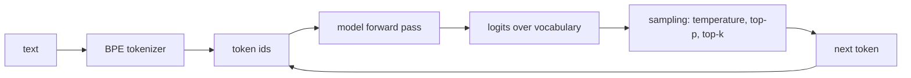

**Takeaway:** There is no "the model said X" - there is a probability distribution plus a sampling policy you chose.

---

## Phase 1 - Local models and serving

**Key concept:** One Java interface, two backends: a locally served quantized model (Ollama / llama.cpp) and a hosted API, swapped behind the same call site.

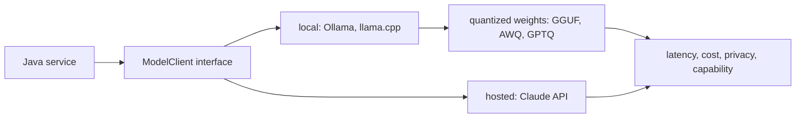

**Takeaway:** Local vs hosted is not an ideology, it is a four-axis tradeoff: latency, cost, privacy, capability - and quantization is how you buy the first two with some of the fourth.

---

## Phase 2 - Prompting and context engineering (RAG)

**Key concept:** Chunk a corpus, embed it, retrieve the top-k chunks for a question, and assemble them into the prompt - context is engineered, not hoped for.

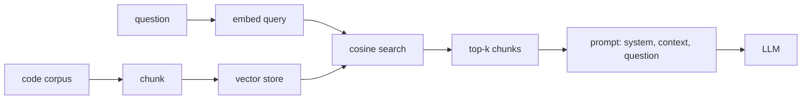

**Takeaway:** The model's answer quality is mostly a function of what you put in the context window, and retrieval is how you decide what that is.

---

## Phase 3 - Tools and function calling

**Key concept:** The model does not call anything: it emits a name plus a JSON argument object against a schema you gave it, and your code executes the call and feeds the result back.

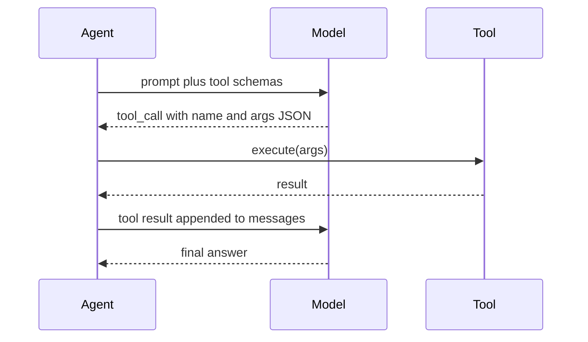

**Takeaway:** A tool call is a structured-output problem wearing a trench coat - validate the args before you execute, always.

---

## Phase 4 - The agent loop

**Key concept:** plan, act, observe, repeat - wrapped in guardrails (max iterations, loop detection, token budget), retries for transient failures, and a memory store that survives the loop.

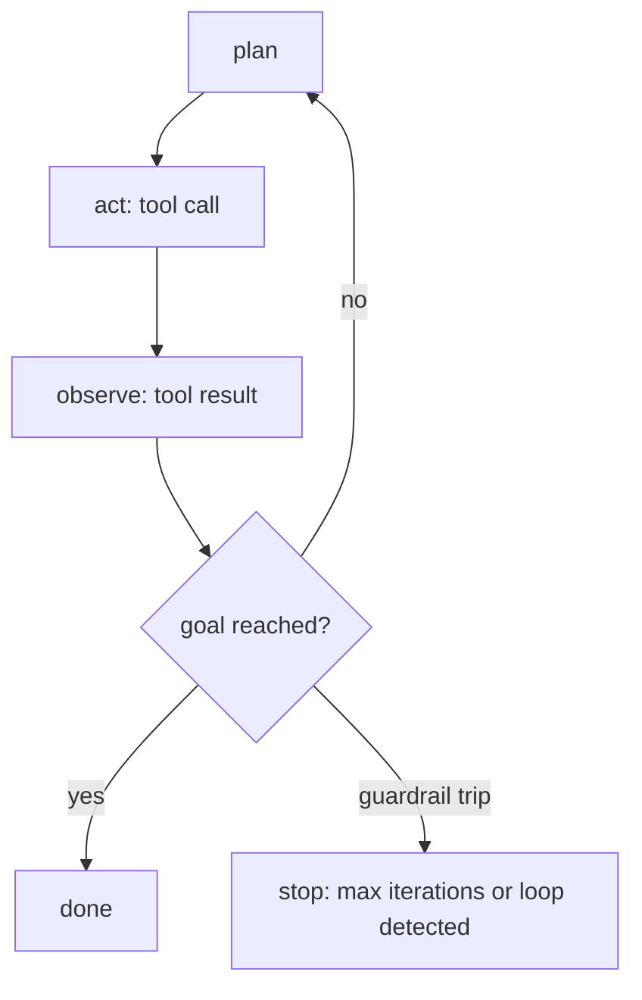

**Takeaway:** The loop is trivial; the rails around it are the engineering. An unguarded loop is a bill, not an agent.

---

## Phase 5 - Skills: packaged instructions

**Key concept:** A skill is instructions plus resources, packaged as a folder and loaded into context on demand, rather than retrieved per query (RAG) or baked into weights (fine-tuning).

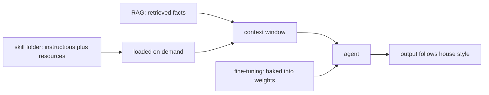

**Takeaway:** Use a skill for how to work, RAG for what is true right now, fine-tuning for a behaviour you cannot afford to re-explain every call.

---

## Phase 6 - MCP: Model Context Protocol

**Key concept:** A client/server protocol (JSON-RPC over stdio) that lets any agent discover and call tools, resources and prompts a server exposes, without compiling that server in.

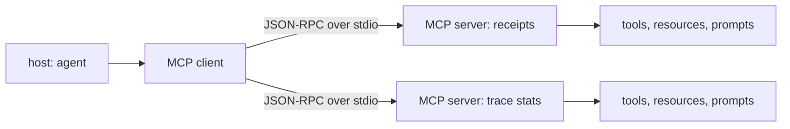

**Takeaway:** MCP turns "my agent's tools" into "any agent's tools" - the integration boundary moves from your codebase to a protocol.

---

## Phase 7 - Multi-agent and A2A

**Key concept:** Specialized agents (coder, reviewer) exchanging typed Task / TaskResult cards through an orchestrator, instead of one agent with one overloaded prompt.

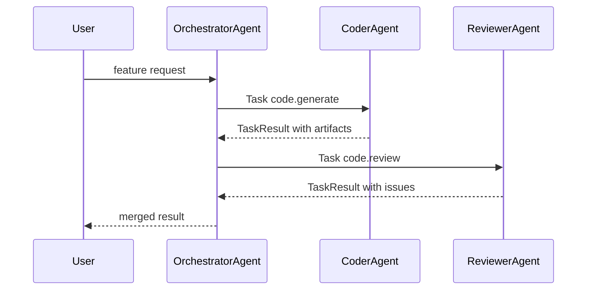

**Takeaway:** Multi-agent buys separation of concerns, and pays for it in handoffs - every boundary is a place a message can be malformed or wrong.

---

## Phase 8 - Autonomous systems with control points

**Key concept:** Ticket in, plan, code, test, PR out - with checkpointed state written to JSONL and named human-in-the-loop gates (GATE1 on the plan, GATE2 on the PR) that can escalate instead of proceeding.

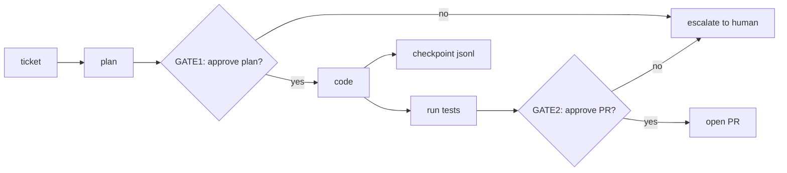

**Takeaway:** Autonomy is not the absence of humans, it is the deliberate placement of the few points where a human is required.

---

## Phase 9 - Agent identity and IAM

**Key concept:** Scoped, time-bounded credentials down a principal chain (EndUser to Orchestrator to Specialized agent), where delegation can only narrow scope and cap expiry - never widen either - and the token never enters the model's context.

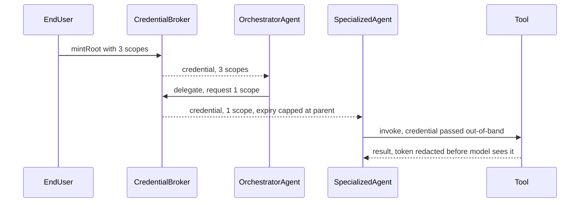

**Takeaway:** Delegation vs impersonation is the entire blast radius: the same task done with a narrowed credential reaches 1 of 3 capabilities, done with the parent's credential reaches 3 of 3.

---

## Phase 10 - Frameworks and protocol standards

**Key concept:** Runtime A2A agent-card discovery over real HTTP (well-known path, trusted origin allowlist checked before any request is sent) plus an x402-shaped payment-required, authorize, retry-once flow.

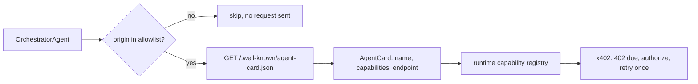

**Takeaway:** Compile-time wiring of agent references is the thing discovery replaces - and "who am I allowed to even ask?" is a security decision that must happen before the socket opens.

---

## Phase 11 - Resilient multi-agent pipeline

**Key concept:** Three independent gates on one chain: a hand-rolled JSON-schema check at every handoff, a per-dependency 3-state circuit breaker on failure streaks, and a confidence threshold the pipeline actually acts on by abstaining.

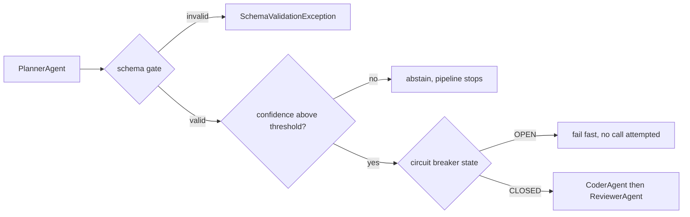

**Takeaway:** Schema-valid and trustworthy are different questions, and a retry and a circuit breaker want opposite things: one tries harder on a call, the other gives up on the dependency.

---

## Phase 12 - Evaluation harness

**Key concept:** Three measurement layers - task-level correctness, trajectory conformance, system-level health - folded into one deterministic 0-100 composite a CI gate can threshold on, run against golden, regression and adversarial trace sets.

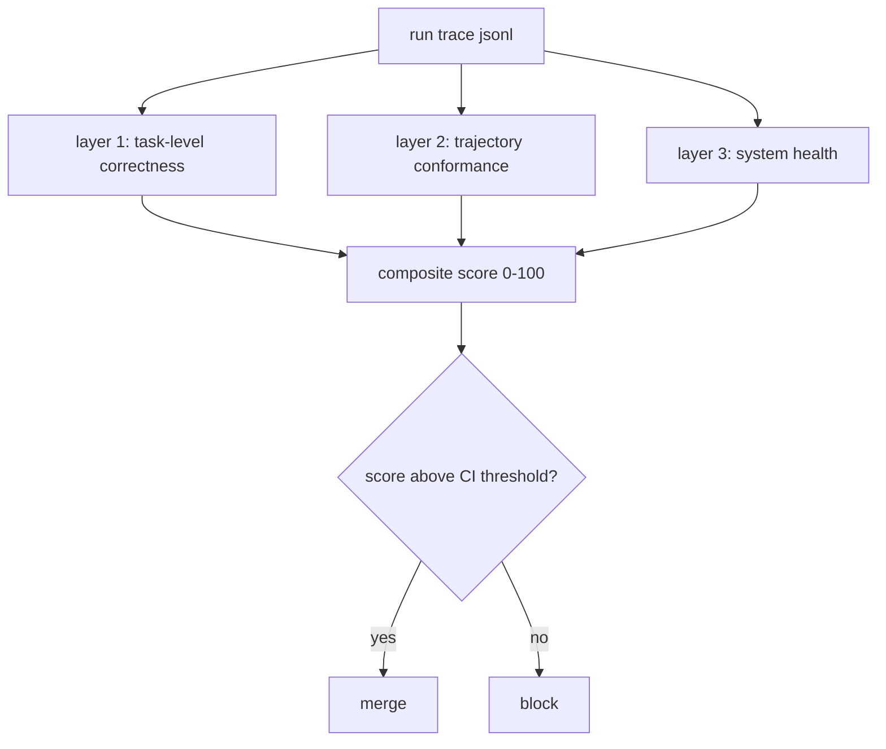

**Takeaway:** A CI gate needs a number that does not change between two runs over the same trace file, which is exactly why the gate math is LLM-free even when a judge model is available.

---

## Phase 13 - Memory v2: ANN, hybrid search, graph

**Key concept:** An HNSW-lite ANN index whose comparison count grows sub-linearly against a brute-force scan, BM25 plus vector fused by reciprocal rank fusion then reranked, and a ranked, bounded, time-decayed memory store replacing the unranked one.

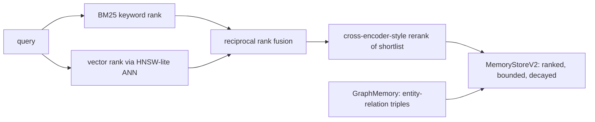

**Takeaway:** "Return everything you remember" is not memory, it is a leak - ranking, a hard bound, and decay are what make recall usable at scale.

---

## Phase 14 - Domain specialization

**Key concept:** Four levers - system prompt, knowledge corpus, tool selection, guardrails - applied to one vertical and run side by side against a baseline agent holding model, temperature and tools constant.

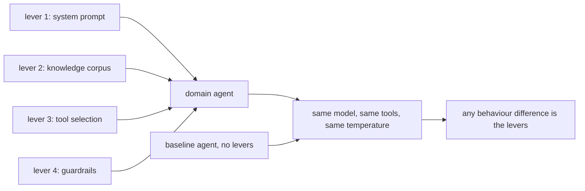

**Takeaway:** Hold the model constant and the levers become the only explanatory variable - that is what makes the comparison mean anything.

---

## Phase 15 - Capstone: the combined chain

`CapstoneDemo` runs one task - *draft the on-call handover note for INC-4471* - through six of the phases above in a single process, deterministically and offline:

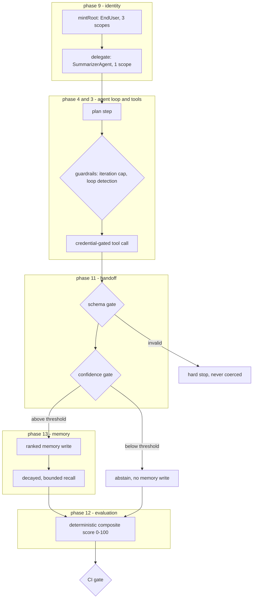

**Takeaway:** the gates are the architecture. A credential that can only narrow, a schema check that refuses to coerce, a confidence threshold that would rather abstain, a memory that ranks and forgets, and a score computed from the run's own trace instead of its own summary - each one is a place the pipeline is allowed to say no.
